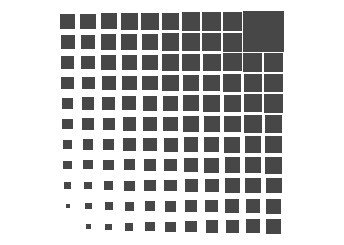

<!-- README.md is generated from README.Rmd. Please edit that file -->

# ggtilesize

<!-- badges: start -->
<!-- badges: end -->

This R package is a ggplot2 extension that provides `geom_tile_size()`,
which is analogous to geom_tile but allows tile size to vary as an
aesthetic parameter.

## Installation

You can install the development version of ggtilesize from GitHub like
so: `devtools::install_github("matthewkling/ggtilesize")`.

## Example

To create a tile-size plot we use `geom_tile_size()`. It requires the x,
y, and scale aesthetics, with the latter corresponding to the size of
tiles; other aesthetics such as fill, color, or alpha are supported as
well. For simplicity we’ll just map scale to the sum of x and y here:

``` r
library(tidyverse)
library(ggtilesize)

d <- expand_grid(x = 0:10, y = 0:10)

p <- ggplot(d, aes(x, y, scale = x + y)) +
      coord_fixed() +
      theme_void()

p + geom_tile_size()
```



Tiles are scaled in both the x and y directions by default, but this can
be changed by setting `sizedims = "x"`, for example. (In either case,
resizing keeps area proportional to the scale variable.)

``` r
p + geom_tile_size(sizedims = "x")
```

 The
`sizelims` parameter can be used to change the range of sizes:

``` r
p + geom_tile_size(sizelims = c(.25, 1.5), alpha = .5)
```


There is no support yet for legends/guides for the scale aesthetic.
Hoping to add that soon.
